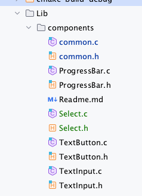

# Allegro5 UI Library

## Installation

1. Extract files into `Lib/components`  


1. (a) Replace `struct Scene` to `AllegroScene in `game.h`

```c
typedef AllegroScene Scene;
```

1. (b) 🚫 Edit `struct Scene` in `game.h`

注意： 如果要加入其他屬性必須加在這些下面

```c
typedef struct {
    char *name;
    func_ptr initialize;
    func_ptr update;
    func_ptr draw;
    func_ptr destroy;
    func_ptr_keyboard on_key_down;
    func_ptr_keyboard on_key_up;
    func_ptr_mouse on_mouse_down;
    func_ptr_mouse on_mouse_move;
    func_ptr_mouse on_mouse_up;
    func_ptr_mouse on_mouse_scroll;
    
    component *components;
    InputType *component_types;
    int component_size;
    
    // TODO: More event callbacks such as timer tick, video finished, ...
} Scene;
```

2. Import `jf.ttf` into `Assets` folder

2. Add to `game_start_event_loop` in `game.c`

```c
register_scene_components(&active_scene, event);
```

2. Add to `game_create` in `game.c`

```c
component_init();
```

3. Initialize the scene in `scene_*.c`

```c    
scene.components = malloc(sizeof(TextInput)*10);
scene.component_types = malloc(10);
scene.component_size = 0;
input = ruru_create_textInput( 20+250, 150, 300, 50, "test");

int cnt = scene.component_size++;
scene.component_types[cnt] = RURU_TEXT_INPUT;
scene.components[cnt] = &input;
```

## Components
* TextInput
* TextButton
* ProgressBar

## Contribute
To add component, following these steps:
1. Add component type in `component.h`
2. Add component in `component.c`
3. Add a new enum of ComponentType in `common.h`
4. Add logic dereference in `register_scene_components` in `component.c`

## Contributors

* Ruru7
* hsuan1117
* LittlePants